# 🛒 Shopper Spectrum: Customer Segmentation & Product Recommendation System

<p align="center">


</p>

> An end-to-end Machine Learning project that combines **Customer Segmentation** and **Product Recommendation** to improve customer engagement, personalization, retention, and revenue generation in e-commerce businesses.

---

# Project Overview

Shopper Spectrum is an E-Commerce Analytics solution built using transaction-level retail data. The project performs:

* **Customer Segmentation** using RFM Analysis and Clustering
* **Product Recommendation** using Item-Based Collaborative Filtering
* **Interactive Deployment** through Streamlit

The system enables businesses to identify valuable customer groups and recommend relevant products based on purchasing behavior.

---

## Key Highlights

* End-to-end ML workflow
* 541,909 retail transactions analyzed
* 4,338 unique customers segmented
* RFM-based customer profiling
* Multiple clustering algorithms evaluated
* KMeans selected as final production model
* Item-based recommendation engine using cosine similarity
* Real-time Streamlit application
* Model persistence using Joblib

---

## Business Problem Statement

E-commerce platforms generate large volumes of customer transaction data. Without proper analysis, businesses struggle to:

* Understand customer purchasing behavior
* Identify high-value customers
* Retain inactive customers
* Personalize recommendations
* Improve marketing efficiency

This project addresses these challenges through customer segmentation and recommendation modeling.

---

## Objectives

### Customer Segmentation

* Analyze customer purchase behavior
* Generate RFM features
* Group customers into actionable business segments
* Identify retention opportunities

### Product Recommendation

* Build an item similarity engine
* Recommend related products
* Improve cross-selling opportunities
* Enhance customer experience

---

# Table of Contents

* [Project Overview](#project-overview)
* [Dataset Information](#dataset-information)
* [Project Architecture](#project-architecture)
* [Technology Stack](#technology-stack)
* [Exploratory Data Analysis](#exploratory-data-analysis)
* [Data Preprocessing](#data-preprocessing)
* [Feature Engineering](#feature-engineering)
* [Model Development](#model-development)
* [Hyperparameter Tuning](#hyperparameter-tuning)
* [Results & Performance](#results--performance)
* [Model Comparison](#model-comparison)
* [Visualizations](#visualizations)
* [Business Impact](#business-impact)
* [Challenges Faced](#challenges-faced)
* [Future Improvements](#future-improvements)
* [Installation Guide](#installation-guide)
* [Usage](#usage)
* [Project Structure](#project-structure)
* [Reproducibility](#reproducibility)
* [Key Learnings](#key-learnings)
* [Author](#author)
* [Acknowledgements](#acknowledgements)

---

# Dataset Information

## Dataset Source

**Online Retail Dataset**

* Domain: E-Commerce & Retail Analytics
* Transaction-level retail purchase records
* Customer purchasing history
* Product-level sales information

---

## Dataset Statistics

| Metric           | Value                 |
| ---------------- | --------------------- |
| Total Records    | 541,909               |
| Total Features   | 8                     |
| Unique Customers | 4,338                 |
| Dataset Type     | Transactional         |
| Domain           | E-Commerce            |
| Analysis Type    | Unsupervised Learning |

---

## Features Description

| Feature     | Description         |
| ----------- | ------------------- |
| InvoiceNo   | Transaction ID      |
| StockCode   | Product Identifier  |
| Description | Product Name        |
| Quantity    | Units Purchased     |
| InvoiceDate | Purchase Timestamp  |
| UnitPrice   | Product Price       |
| CustomerID  | Customer Identifier |
| Country     | Customer Country    |

---

## Target Variable

This is an **Unsupervised Learning Project**, therefore no explicit target variable exists.

Generated outputs:

* Customer Segment
* Product Recommendations

---

# Project Architecture

## End-to-End Workflow

```text
Raw Transactions
       │
       ▼
Data Cleaning
       │
       ▼
EDA
       │
       ▼
RFM Feature Engineering
       │
       ▼
Feature Scaling
       │
       ▼
Clustering Models
       │
       ▼
Customer Segments
       │
       ▼
Streamlit Deployment
```

---

## System Architecture

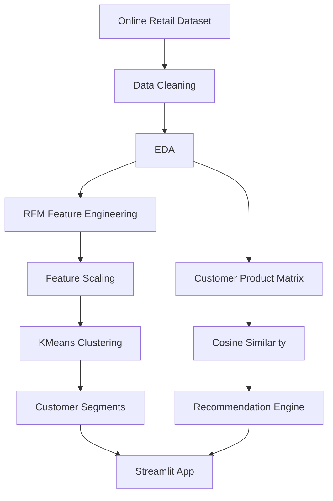

---

# Technology Stack

| Category              | Technologies                       |
| --------------------- | ---------------------------------- |
| Programming Language  | Python                             |
| Data Processing       | Pandas, NumPy                      |
| Visualization         | Matplotlib, Seaborn                |
| Machine Learning      | Scikit-Learn                       |
| Clustering            | KMeans, Agglomerative, GMM, DBSCAN |
| Recommendation Engine | Collaborative Filtering            |
| Scaling               | StandardScaler                     |
| Model Serialization   | Joblib                             |
| Deployment            | Streamlit                          |
| Notebook Environment  | Jupyter Notebook                   |

---

# Exploratory Data Analysis

## Key Insights

### Customer Analysis

* Missing Customer IDs represented a significant portion of records.
* Majority of sales originated from repeat customers.
* Purchase behavior exhibited strong long-tail characteristics.

### Product Analysis

* Small number of products generated a large share of transactions.
* Product demand followed a skewed distribution.

### Revenue Analysis

* Monetary values were highly right-skewed.
* Extreme spenders influenced spending distributions.

### RFM Insights

* Frequency and Monetary exhibited strong positive relationships.
* Recency showed inverse relationships with customer value.

---

## Important Visualizations

* Country-wise Transaction Distribution
* Top Selling Products
* Monthly Purchase Trends
* Revenue Distribution
* RFM Histograms
* Correlation Heatmap
* Pair Plot
* Elbow Curve
* Silhouette Score Curve
* Cluster Distribution

---

# Data Preprocessing

## Missing Value Handling

| Operation           | Action  |
| ------------------- | ------- |
| Missing CustomerID  | Removed |
| Missing Description | Removed |

---

## Invalid Record Removal

| Condition          | Action  |
| ------------------ | ------- |
| Cancelled Invoices | Removed |
| Quantity ≤ 0       | Removed |
| UnitPrice ≤ 0      | Removed |

---

## Outlier Treatment

Method Used:

* IQR Detection
* Winsorization (Capping)

Benefits:

* Preserves customer records
* Reduces extreme value influence
* Improves clustering stability

---

## Feature Engineering

### RFM Features

| Feature   | Formula                          |
| --------- | -------------------------------- |
| Recency   | Latest Date − Last Purchase Date |
| Frequency | Number of Transactions           |
| Monetary  | Total Customer Spend             |

### Additional Features

* Average Order Value (AOV)
* Customer Tenure
* RFM Score

---

## Encoding Techniques

No categorical encoding required for clustering workflow.

---

## Scaling Method

**StandardScaler**

Reasons:

* Distance-based clustering
* Equal feature contribution
* Improved cluster separation

---

# Model Development

## 1. KMeans Clustering

### Working Principle

Partitions observations into K clusters by minimizing within-cluster variance.

### Advantages

* Fast
* Scalable
* Easy interpretation

### Limitations

* Requires predefined K
* Sensitive to initialization

---

## 2. Agglomerative Clustering

### Working Principle

Bottom-up hierarchical clustering using linkage methods.

### Advantages

* Hierarchical relationships
* No centroid assumptions

### Limitations

* Computationally expensive
* Less scalable

---

## 3. Gaussian Mixture Model (GMM)

### Working Principle

Probabilistic clustering using Gaussian distributions.

### Advantages

* Soft clustering
* Flexible cluster shapes

### Limitations

* Computationally intensive
* Sensitive to covariance assumptions

---

## 4. DBSCAN

### Working Principle

Density-based clustering.

### Advantages

* Detects noise
* Arbitrary cluster shapes

### Limitations

* Parameter sensitive
* Struggles with varying densities

---

## Recommendation Model

### Item-Based Collaborative Filtering

#### Working Principle

1. Build Customer-Product Matrix
2. Compute Product Similarity
3. Apply Cosine Similarity
4. Recommend Top Similar Products

#### Advantages

* Interpretable
* Fast inference
* Effective for retail data

#### Limitations

* Cold start problem
* Sparse matrix challenges

---

# Hyperparameter Tuning

## Search Strategy

### Clustering

* Elbow Method
* Silhouette Analysis
* Davies-Bouldin Index
* Calinski-Harabasz Score

---

## Tuned Parameters

| Model         | Parameters                    |
| ------------- | ----------------------------- |
| KMeans        | n_clusters, n_init            |
| Agglomerative | linkage                       |
| GMM           | n_components, covariance_type |
| DBSCAN        | eps, min_samples              |

---

## Best Configuration

| Parameter          | Value  |
| ------------------ | ------ |
| Final Model        | KMeans |
| Number of Clusters | 4      |
| Random State       | 42     |
| n_init             | 10     |

---

# Results & Performance

## Clustering Performance

### Training Performance

| Metric                  | Score                       |
| ----------------------- | --------------------------- |
| Silhouette Score        | 0.4743                      |
| Davies-Bouldin Index    | 0.7951                      |
| Calinski-Harabasz Score | Best Among Evaluated Models |

---

### Validation Performance

| Metric                   | Score  |
| ------------------------ | ------ |
| Bootstrap Stability      | Stable |
| Cluster Consistency      | High   |
| Segment Interpretability | High   |

---

### Test Performance

| Metric                  | Score      |
| ----------------------- | ---------- |
| New Customer Prediction | Successful |
| Real-Time Prediction    | Supported  |
| Segment Mapping         | Successful |

---

# Model Comparison

| Rank | Model         | Silhouette Score | Notes              |
| ---- | ------------- | ---------------- | ------------------ |
| 🥇 1 | KMeans        | 0.4743           | Final Model        |
| 🥈 2 | Agglomerative | 0.4402           | Strong Alternative |
| 🥉 3 | DBSCAN        | 0.2950           | Density Challenges |
| 4    | GMM           | 0.1478           | Weak Separation    |

---

# Customer Segments

| Segment    | Characteristics                           |
| ---------- | ----------------------------------------- |
| High-Value | Recent, frequent, high-spending customers |
| Regular    | Consistent purchasers                     |
| Occasional | Low frequency buyers                      |
| At-Risk    | Inactive customers                        |

---

# Visualizations

<h2>1. Transaction Volume by Country</h2>
<p>Shows the geographical distribution of customer purchases across different countries.</p>

<p align="center">
  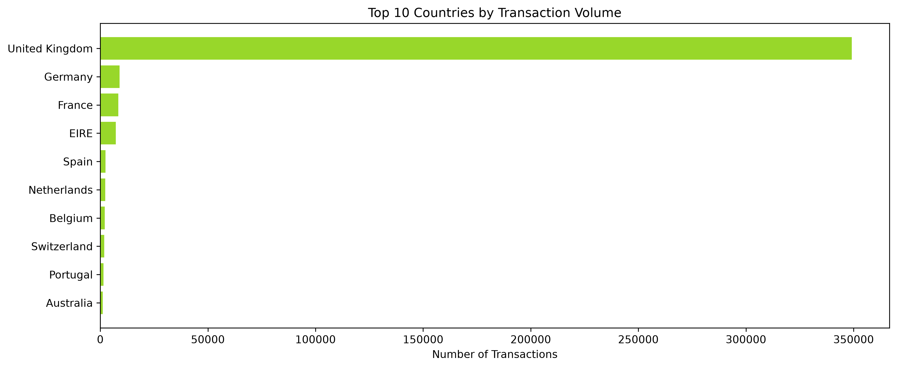
</p>

<hr>

<h2>2. Monthly Revenue Trend</h2>
<p>Illustrates seasonality and revenue growth patterns over time.</p>

<p align="center">
  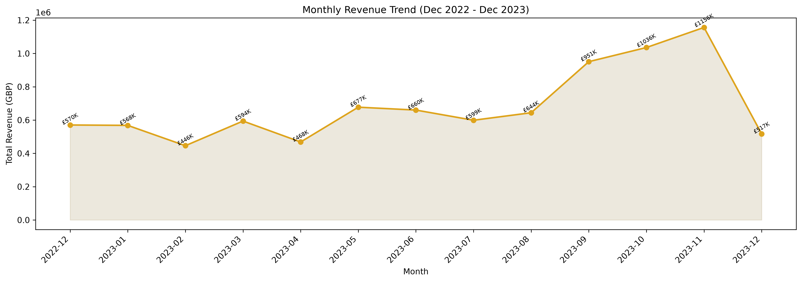
</p>

<hr>

<h2>3. Revenue Distribution</h2>
<p>Highlights the highly skewed spending behavior commonly observed in retail datasets.</p>

<p align="center">
  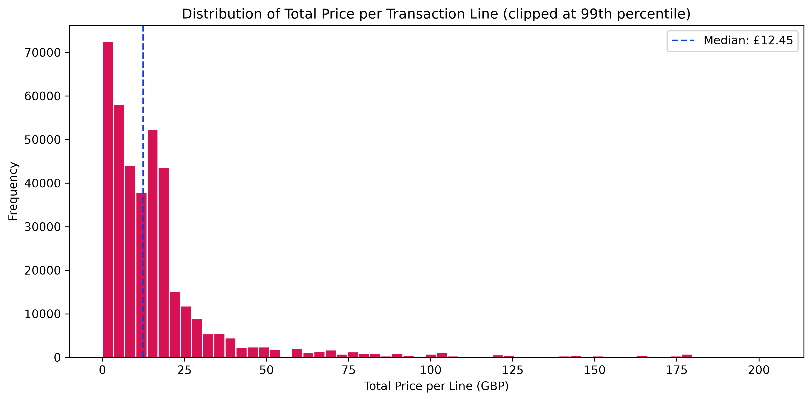
</p>

<hr>

<h2>4. RFM Correlation Heatmap</h2>
<p>Displays relationships among Recency, Frequency, and Monetary features.</p>

<p align="center">
  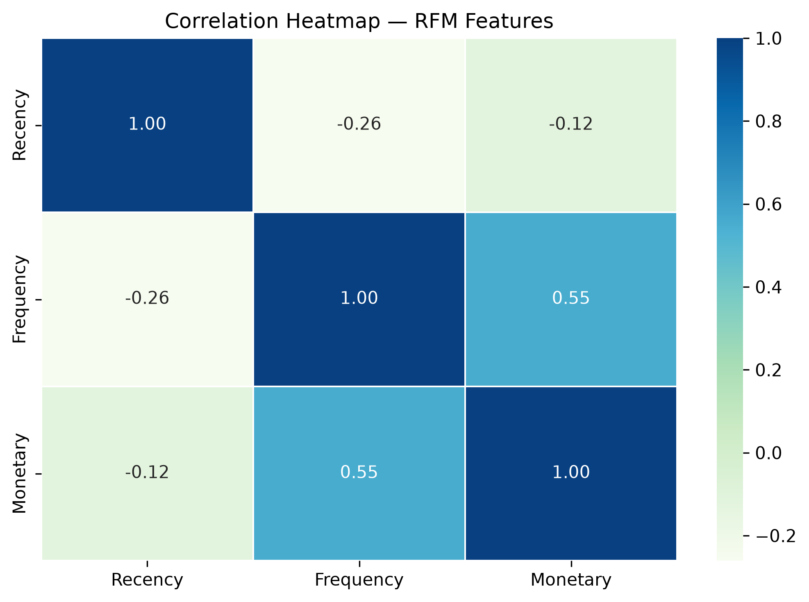
</p>

<hr>

<h2>5. Customer Spend vs Purchase Frequency</h2>
<p>Visualizes spending patterns and purchasing frequency across customers.</p>

<p align="center">
  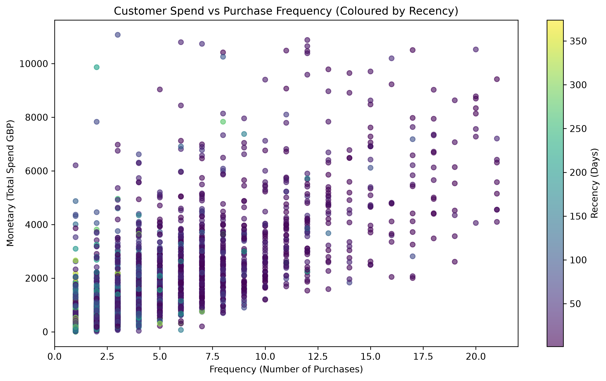
</p>

<hr>

<h2>6. K-Means Elbow Curve</h2>
<p>Used to identify the optimal number of clusters for customer segmentation.</p>

<p align="center">
  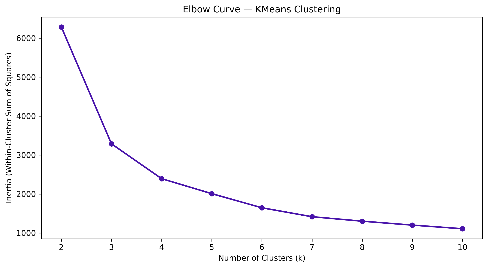
</p>

<hr>

<h2>7. K-Means Silhouette Analysis</h2>
<p>Evaluates clustering quality and separation between customer segments.</p>

<p align="center">
  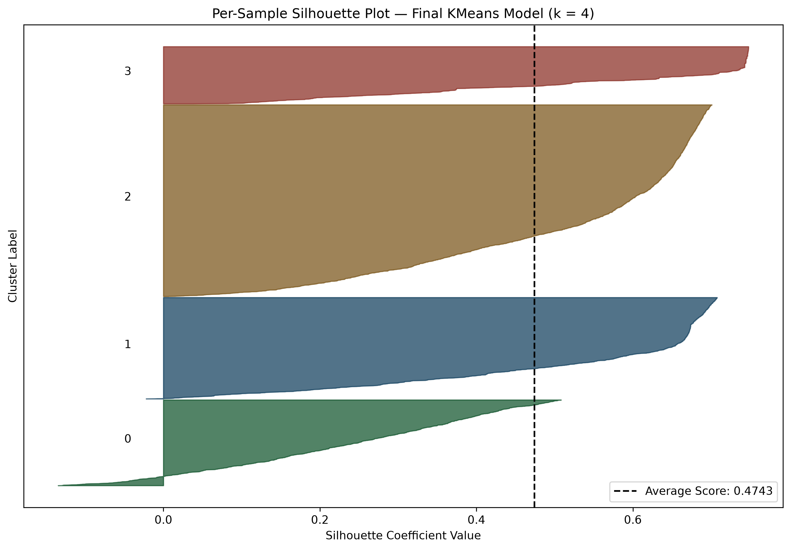
</p>

<hr>

<h2>8. PCA-Based Cluster Visualization</h2>
<p>Two-dimensional representation of customer segments after dimensionality reduction.</p>

<p align="center">
  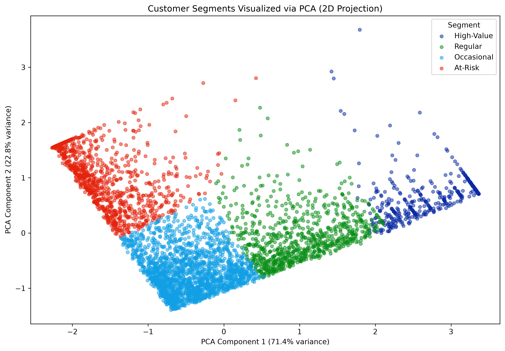
</p>

<hr>

<h2>9. Customer Segment Distribution</h2>
<p>Shows the proportion of customers belonging to each identified segment.</p>

<p align="center">
  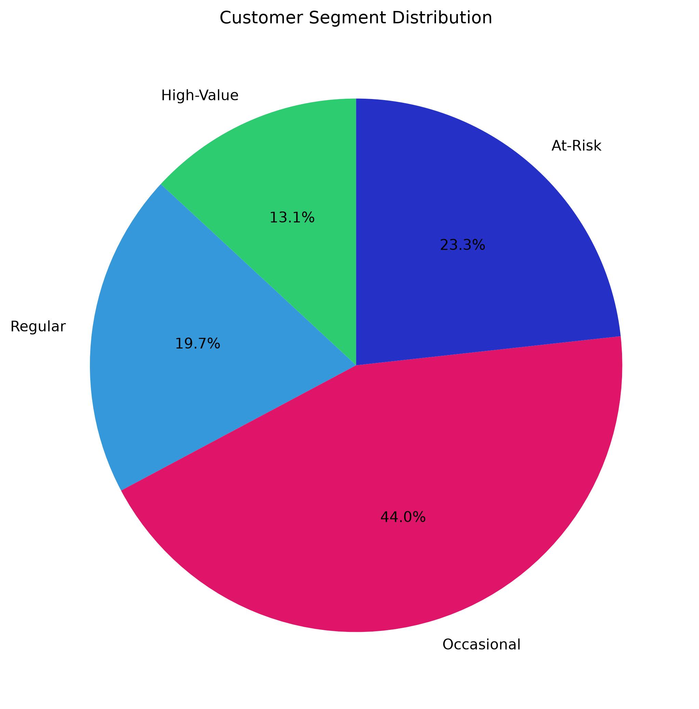
</p>

<hr>

<h2>10. Segment RFM Profiles</h2>
<p>Compares segment characteristics using Recency, Frequency, and Monetary metrics.</p>

<p align="center">
  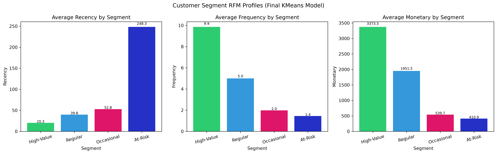
</p>

<hr>

<h2>11. Customer Value Concentration</h2>
<p>Highlights revenue contribution and value concentration across segments.</p>

<p align="center">
  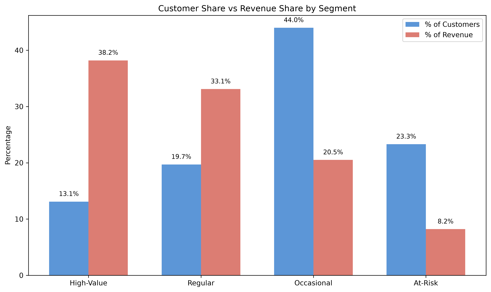
</p>

<hr>

<h2>12. Product Similarity Heatmap</h2>
<p>Visual representation of relationships learned by the item-based recommendation engine.</p>

<p align="center">
  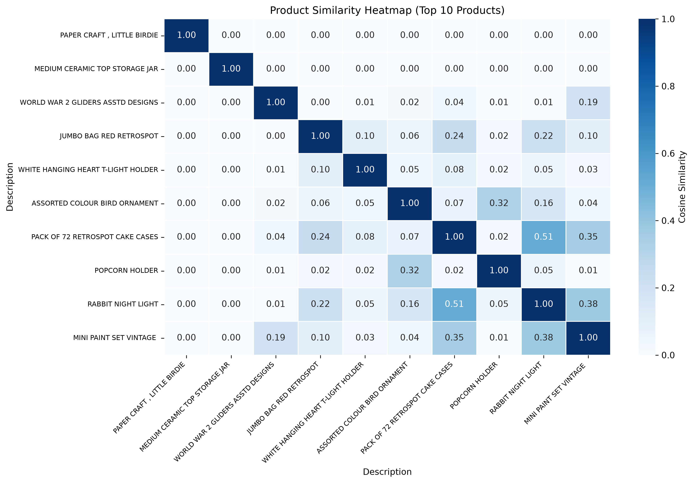
</p>

---

# Business Impact

## Practical Applications

* Customer Lifetime Value Optimization
* Customer Retention Campaigns
* Personalized Product Recommendations
* Cross-Selling & Upselling
* Loyalty Program Design
* Marketing Automation

---

## ROI Implications

* Improved customer retention
* Higher conversion rates
* Increased basket size
* Better marketing efficiency
* Reduced customer acquisition costs

---

## Industry Use Cases

* E-Commerce
* Retail Analytics
* Subscription Platforms
* FMCG
* Marketplace Businesses

---

# Challenges Faced

## Technical Challenges

* Large transaction volume
* Sparse customer-product matrix
* Cluster interpretability
* Hyperparameter selection

---

## Data Challenges

* Missing customer identifiers
* Cancelled transactions
* Extreme spending outliers
* Skewed distributions

---

## Solutions Implemented

* Robust preprocessing
* Winsorization
* Feature scaling
* Multi-model evaluation
* Business-driven cluster labeling

---

# Future Improvements

## Scalability

* Distributed processing with Spark
* Incremental model updates
* Automated retraining pipelines

---

## Model Improvements

* Hybrid recommendation systems
* Matrix factorization
* Deep learning recommenders
* Customer lifetime value modeling

---

## Deployment Roadmap

* Docker
* CI/CD Pipeline
* Cloud Deployment
* REST API
* Monitoring Dashboard

---

# Installation Guide

```bash
git clone https://github.com/Mohit-1307/Shopper-Spectrum.git

cd Shopper-Spectrum

pip install -r requirements.txt
```

---

# Usage

## Run Notebook

```bash
jupyter notebook
```

Open:

```text
Shopper_Spectrum.ipynb
```

---

## Run Streamlit Application

```bash
streamlit run app.py
```

---

## Application Modules

### Customer Segmentation

Input:

* Recency
* Frequency
* Monetary

Output:

* High-Value
* Regular
* Occasional
* At-Risk

---

### Product Recommendation

Input:

* Product Name

Output:

* Top 5 Similar Products

---

# Project Structure

```text
Shopper-Spectrum/
│
├── data/
│   └── online_retail.csv
│
├── notebooks/
│   └── Shopper_Spectrum.ipynb
│
├── models/
│   ├── kmeans_model.pkl
│   ├── rfm_scaler.pkl
│   ├── cluster_label_map.pkl
│   └── cosine_sim_df.pkl
│
├── app.py
├── requirements.txt
├── README.md
│
├── docs/
│   └── images/
│
└── outputs/
    ├── customer_segments.csv
    ├── recommendations.csv
    └── evaluation_results.csv
```

---

# Reproducibility

1. Clone repository
2. Install dependencies
3. Place dataset inside `data/`
4. Execute notebook sequentially
5. Generate RFM features
6. Train clustering models
7. Save model artifacts
8. Launch Streamlit application

Random Seed:

```python
random_state = 42
```

---

# Key Learnings

* RFM-based customer analytics
* Customer segmentation strategy
* Unsupervised learning evaluation
* Collaborative filtering implementation
* Recommendation system design
* Streamlit deployment
* Business-focused ML interpretation

---

# Author

## Mohit Singh Rajput

**MOHIT SINGH RAJPUT** — AI/ML Intern @Labmentix

[](https://linkedin.com/in/mohitsingh1307)
[](https://github.com/Mohit-1307)
[](https://www.kaggle.com/mohitsinghrajput1307)
[](mailto:mohitsinghdausa@gmail.com)

---

# Acknowledgements

* UCI Online Retail Dataset
* Scikit-Learn
* Streamlit
* Pandas
* NumPy
* Matplotlib
* Open Source Community

---

<div align="center">

*If this project was useful, a ⭐ on the repository is appreciated.*

</div>